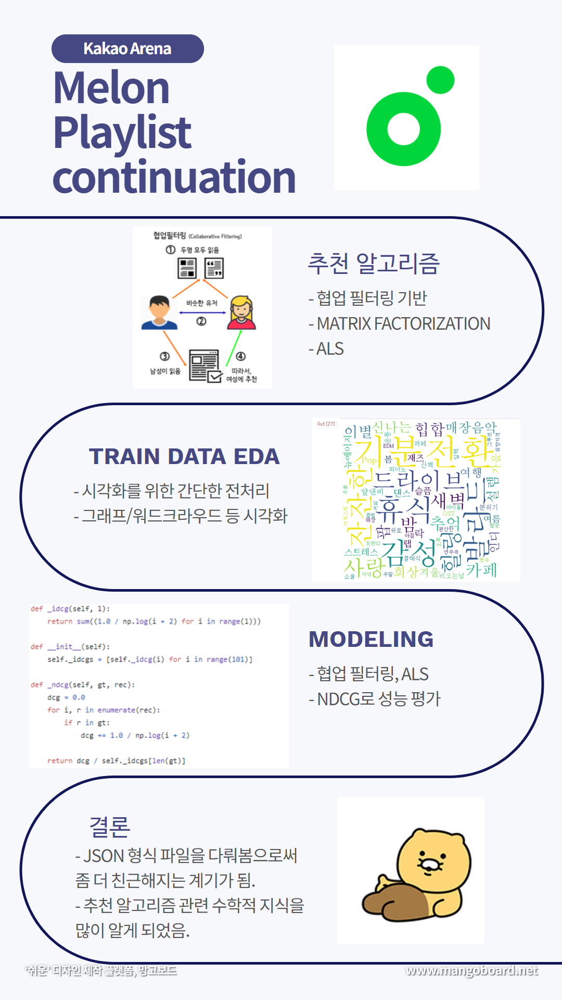

# DAC7_kakao-arena-Melon_Playlist_Continuation [20210227 ~ 20210405]

- The goal of this competition is to predict songs and tags that are not given when half or all of the songs and tags on the playlist are hidden.

- Khaiii tokenize, collaborative filtering, matrix factorization, als

### Competition : [Melon Playlist Continuation](https://arena.kakao.com/c/8)
- This repo is maintained by 허지혜, 최우철, 강수연

[[Presentation]](https://github.com/jihyeheo/DAC7_kakao-arena-Melon_Playlist_Continuation/blob/main/Presentation.pdf)


[[Information]](C:/Users/hu612/Desktop/School/수DA쟁이/Project/팀과제/수연우철/information)

## Infographic



## Reference
```
[1] Train.json EDA, https://arena.kakao.com/forum/topics/191
[2] collaborative filtering, https://arena.kakao.com/forum/topics/227
[3] Matrix factorization, https://arena.kakao.com/forum/topics/200
[4] baseline code, https://github.com/kakao-arena/melon-playlist-continuation
[4] study baseline code, https://bladejun.tistory.com/21
```


